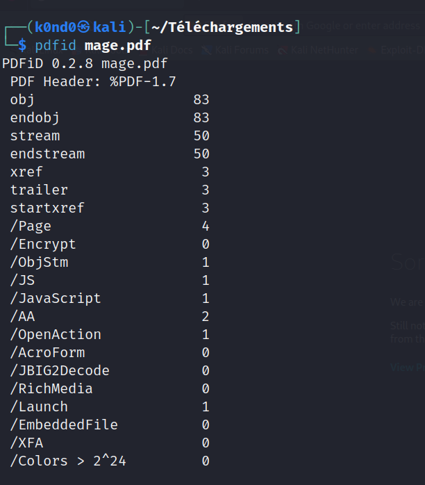
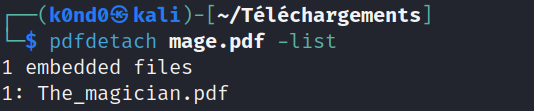
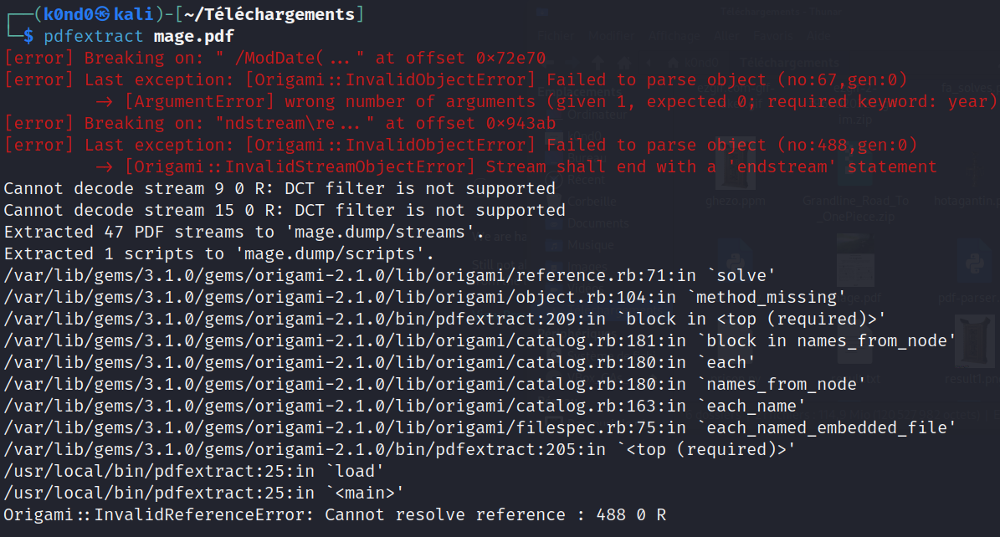
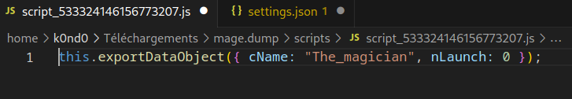
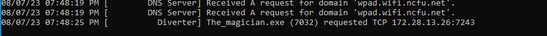

Énoncé

**Pts: XX**

[FR]
Dans ce challenge, votre mission est de déterminer avec qui l'espion communique (adresse IP et port). Vous avez à votre disposition un fichier PDF nommé `mage.pdf`. 

Le format du flag est `CTF_IP:Port`.

Solution

En analysant le fichier `mage.pdf` avec `pdfid`, nous avons repéré des caractéristiques inhabituelles, notamment `/OpenAction` et `/Lauch`, suggérant qu'une action est déclenchée à l'ouverture du fichier. De plus, la présence de code JavaScript indique que ce script s'exécute automatiquement lors de l'ouverture du PDF.

Nous avons alors extrait le contenu du fichier JavaScript à l'aide de l'outil `pdfdetach`. Dans le JavaScript, nous avons trouvé une référence à un fichier nommé `The_magician.pdf`. 

Cependant, nos tentatives pour extraire directement ce fichier avec `pdfextract` ont échoué.

En explorant le dossier `mage.dump` créé par `pdfextract`, nous avons découvert un dossier `scripts` contenant des fichiers JavaScript. En ouvrant l'un de ces scripts, nous avons pu confirmer qu'il était responsable de la création du fichier `The_magician.pdf`.

Nous avons ensuite ouvert `The_magician.pdf` dans un environnement contrôlé sous Windows à l'aide d'une machine virtuelle équipée d'Adobe Acrobat. À l'ouverture du fichier, une fenêtre est apparue nous permettant de le sauvegarder. Nous l'avons enregistré, transféré sur notre machine Linux et utilisé la commande `file` pour déterminer qu'il s'agissait d'un exécutable Windows (`.exe`) plutôt que d'un PDF.

En lançant `The_magician.pdf` dans notre environnement Windows contrôlé tout en surveillant les communications avec l'outil `Fakenet NG`, nous avons observé qu'il tentait de contacter une adresse IP spécifique sur un port donné.

Le format du flag pour ce challenge est `CTF_IP:Port`. En extrayant les informations d'adresse IP et de port à partir des communications surveillées par `Fakenet NG`, nous avons obtenu le flag correct.

Flag: `CTF_172.28.13.26:7243`

