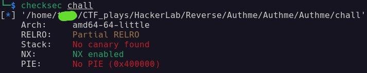
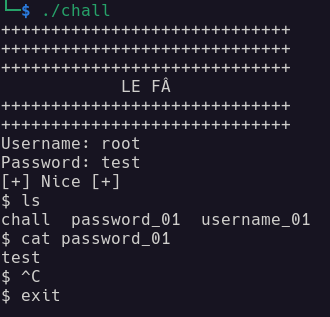
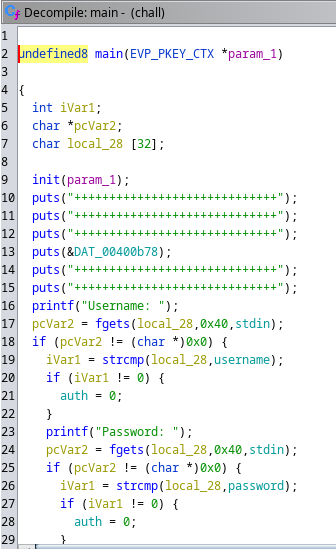
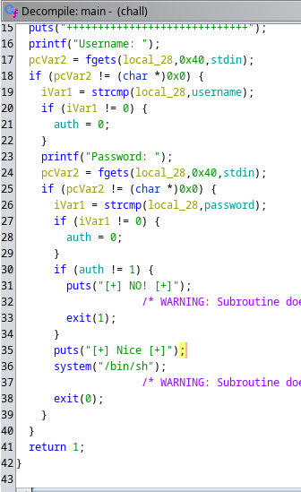
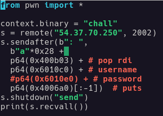
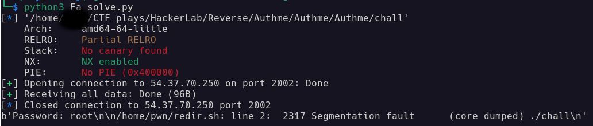
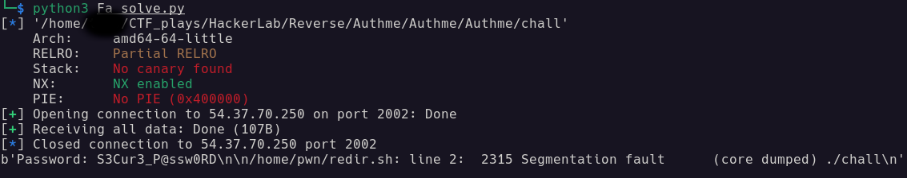
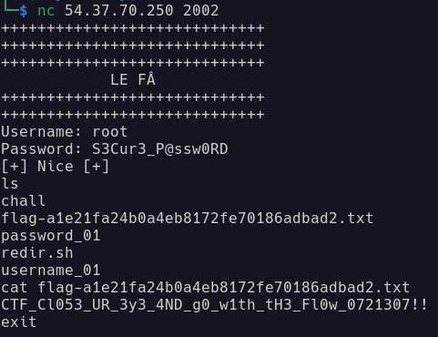

# Énoncé

Énoncé

**Pts: 100**

**nc 54.37.70.250 2002**

Author: charliepy

File: [**Authme**](https://gitlab.com/n4t10n/specifique-writeup/-/blob/main/Writeup_Hackerlab_Qualif_2023/Basic/Challenge%20file/Authme.zip)

# Solution

Solution

Nous voici face au Challenge **Le Fâ.** On passe rapidement à une vérification des protection du fichier binaire

Nous pouvons constaté que la protection **PIE** n'est pas activé donc les adresses mémoires seront identiques à chaque lancement du binaire. Au démarrage du binaire lorsque l'authentification est réussi on a accès à un shell permettant de ce promené dans tout les répertoires comme indiqué ci bas:

Donc Nous connaissons l'objectif du chall c'est de réussir l'authentification afin d'ouvrir le fichier **flag.txt.** Quand nous décompilons ce dernier avec **Ghidra**, voilà ce que nous présente la fonction **main**

J'ai pensé qu'il suffisait de provoquer un dépassement de tampon dans la pile (stack buffer overflow) pour écraser l'adresse de retour et sauter à l'intérieur de la condition **if (auth == 1)**. Cependant, j'ai remarqué que l'adresse contenait des caractères **\n**. Eh bien, cela devrait être gérable, mais le problème est que le programme se termine avec **exit(0)** et ne revient pas à la fonction **main**.

Alors j'ai procédé autrement l'objectif, est de voler le **Username** et le **Password** sur le serveur, mais comment c'est possible. Avec l'outil **gdb** quand on désassemble la fonction main on retrouve l'adresse de stockage du Username et du Password en commentaire (ça fait 1). Ensuite nous allons recherché l'adresse d'un **pop rdi ; ret** pour insérer le Username puis après le Password dans le régistre RDI (ça fait 2) avec la commande:

    ROPgadget --binary chall | grep "pop rdi"

Enfin je devais retrouver l'adresse de la fonction **puts** pour afficher le Username et le Password après leurs insertion dans le RDI. J'ai retrouvé ce dernier toujours en avec **gdb** en désassemblant la fonction main. Voilà le script de résolution:

File: [**Fa_solve**](https://gitlab.com/n4t10n/specifique-writeup/-/blob/main/Writeup_Hackerlab_Qualif_2023/Basic/Challenge%20file/Fa_solve.py)

Extrait de l'attaque:

Flag: **CTF_Cl053_UR_3y3_4ND_g0_w1th_tH3_Fl0w_0721307!!**

