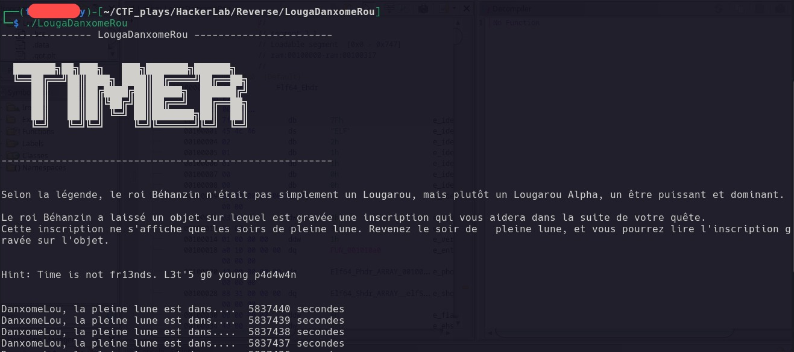
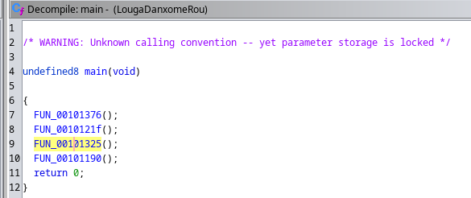
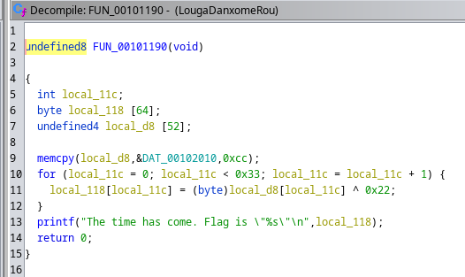
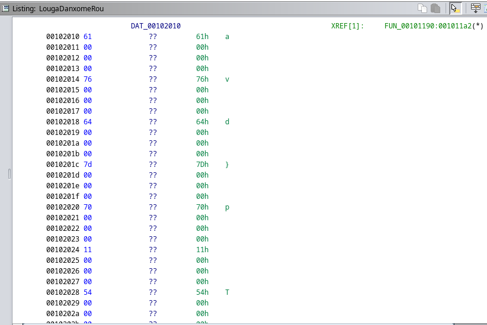
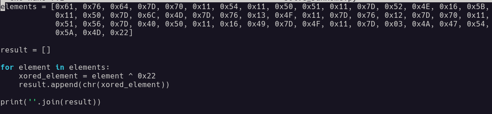
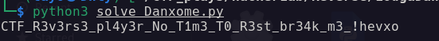

# Énoncé

Énoncé

**Pts: 100**

[FR]
La légende raconte que le roi Béhanzin était un Lougarou Alpha. Au cours de votre quête, vous avez découvert un objet renfermant une inscription qui vous rapprochera de votre objectif. Une course à la montre ?

[EN]
The legend tells that King Béhanzin was an Alpha Lougarou. During your quest, you have discovered an object containing an inscription that will bring you closer to your goal. A race against time?

Author: W1z4rd

File: [**LougDanhomeRou**](https://gitlab.com/n4t10n/specifique-writeup/-/blob/main/Writeup_Hackerlab_Qualif_2023/Basic/Challenge%20file/LougaDanxomeRou.zip)

# Solution

Solution

Au lancement du binaire on a:

Nous avons un **Hint: Time is not fr13nds. L3t'5 g0 young p4d4w4n.** Celà nous fait comprendre qu'on pourra pas attendre la fin du décompte ce qui nous amène à jeter un coup d'oeil sur le code du binaire. Avec l'outil **Ghidra** nous décompilons ce dernier et retrouvons la fonction main qui fait un appel de plusieurs fonctions:

Parmis toutes ces fonctions voici celle qui attire le plus l'attention **FUN_00101190**

Au début de la fonction les variables **local_118** et **local_d8** des tableaux de tailles respectifs **64** et **52** sont déclarées. Nous constatons dans le code que des valeurs hexas sont pris de la variable **local_d8** et sont utilisés pour effectuer une opération **XOR** avec la valeur **0x22** avant de stocker la nouvelle valeur dans la variable **local_118** pour être ensuite affiché en tant que flag, donc dans la partie assembleur du binaire dans Ghidra on a retrouvé les différentes valeurs stockées dans la variable **local_d8**:

Donc nous avons récupéré toutes ces valeurs stockées dans **local_d8** puis nous avons écrit un script python pour effectuer le calcul et trouver le flag

Flag: **CTF_R3v3rs3_pl4y3r_No_T1m3_T0_R3st_br34k_m3_!hevxo**

File: [_Danxome_solve_](https://gitlab.com/n4t10n/specifique-writeup/-/blob/main/Writeup_Hackerlab_Qualif_2023/Basic/Challenge%20file/solve_Danxome.py)

