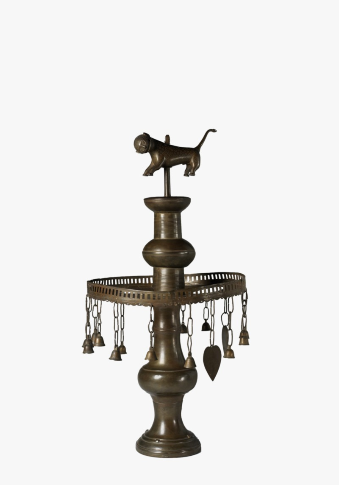
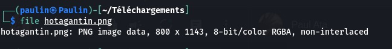
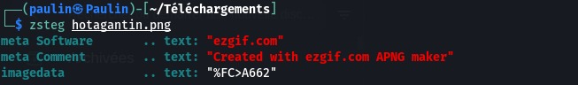
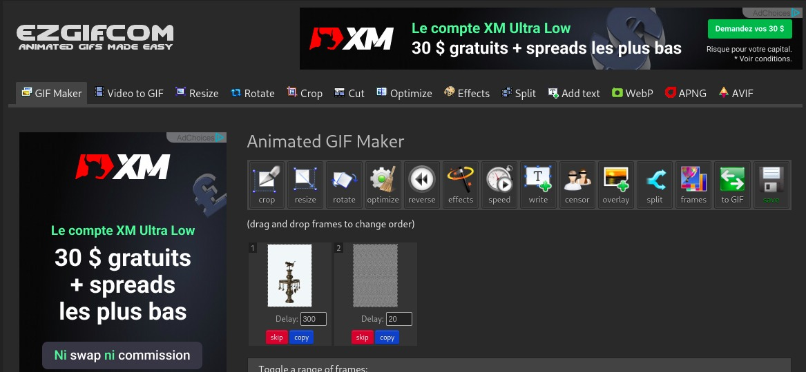
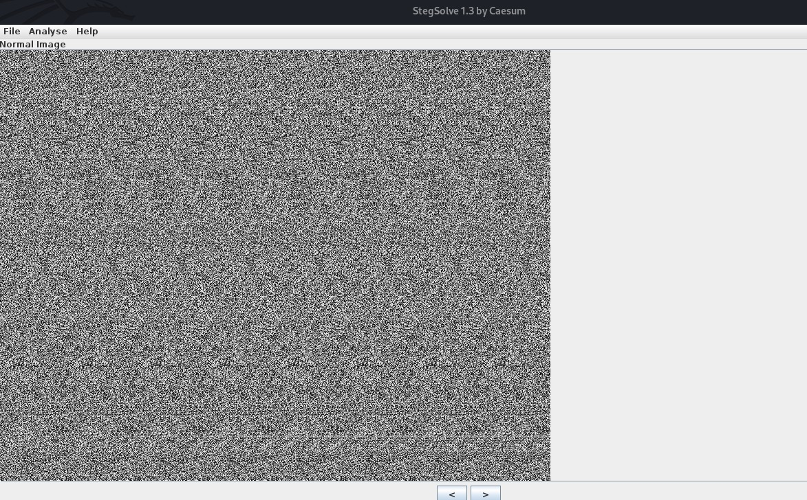
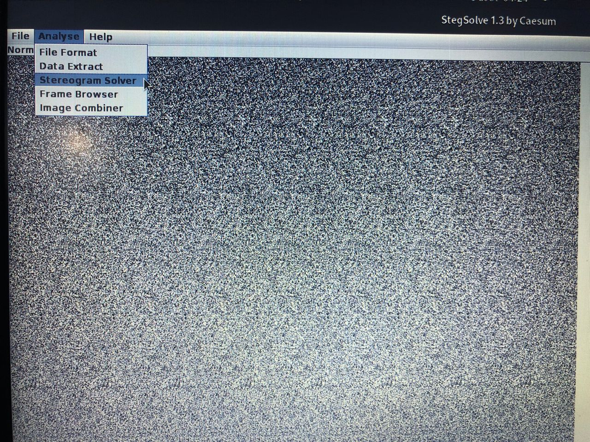
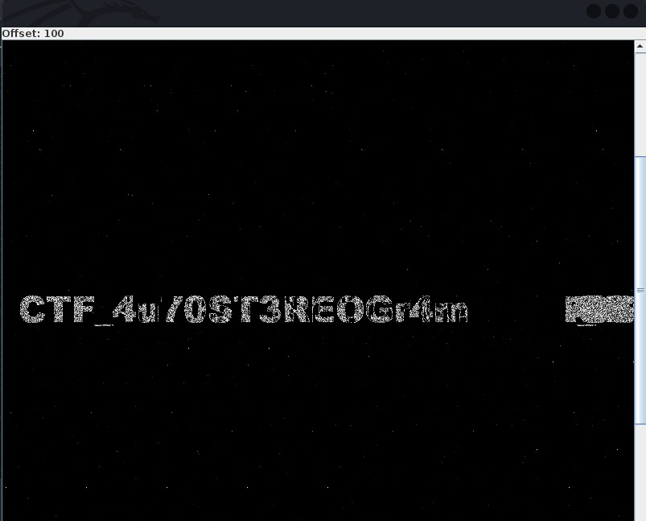

# Énoncé

Énoncé

Asen Hotagantin
70
STEG
[FR ]
Pourras-tu mettre en lumière le secret ancestral que cache ce joyau ?

[EN]
Can you shed light on the ancestral secret that this jewel hides?

Author: charliepy

# Solution

Solution

Asen Hotagantin
Pour ce challenge , nous allo,s tpoukours continuer avec les vieilles habitude. commmençons par faire un ( file nom_du_fichier) pour voir la nature de notre image.

ainsi nous sommes vraiment sûre que notre image est un fichier .png .
Nous allons donc essayer de voir qu'es ce qui nous ai cacher derriere cette image en utilisant la commande "zsteg".

nous avons rien de tres important comme contenu , mais néanmoins nous avons le nom de la plateforme utiliser pour creer ou convertir l'image ( je ne sais pas trop ; tout ce que vous voulez ). cependant , nous allons nous rendre sur cette plateforme et voir de quoi sagit il ....
Le nom de la plateforme nous dit a peu prêt a quoi il peut servir (ezgif). Nous avons donc pensez à convertir notre image en GIF

Après conversion sur la plateforme, nous nous rendons compte que notre image convertie en GIF comporte deux images (une première qui est l'image de départ et une deuxième qui est une image nouvelle).
Selon a quoi allons-nous nous intéresser ?
À la deuxième image sans aucun doute. Nous avons donc enregistré la deuxième image et nous nous sommes rendu sur https://www.aperisolve.com/ pour voir s'il avait quelque de caché derrière des filtres ; mais rien. Nous sommes donc diriger vers " stegsolve «. C’est donc dans cette application à interface graphique que nous allons continuer nos fouilles
Nous ouvrons donc l'image télécharger du site ezgif.com avec stegsolve

Ensuite nous allons dans l'onglet analyse puis nous cliquons sur stéréogramme Solver

garce au bouton de direction < > situer en dessous de  l'image, nous avons défiler jusqu'à ce que nous tombons sur cette image.

ce qui nous a permis de valider le challenge

