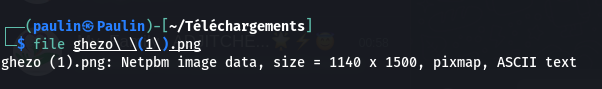
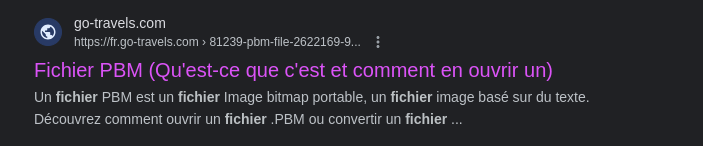
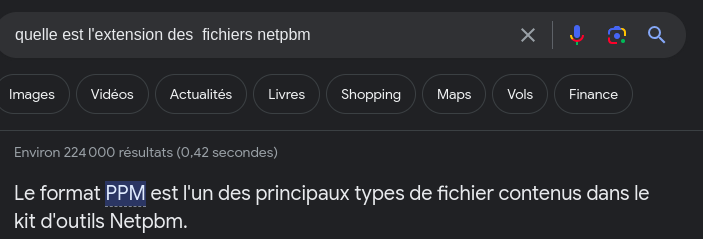
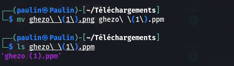
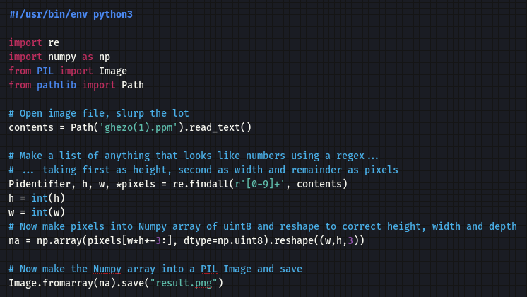
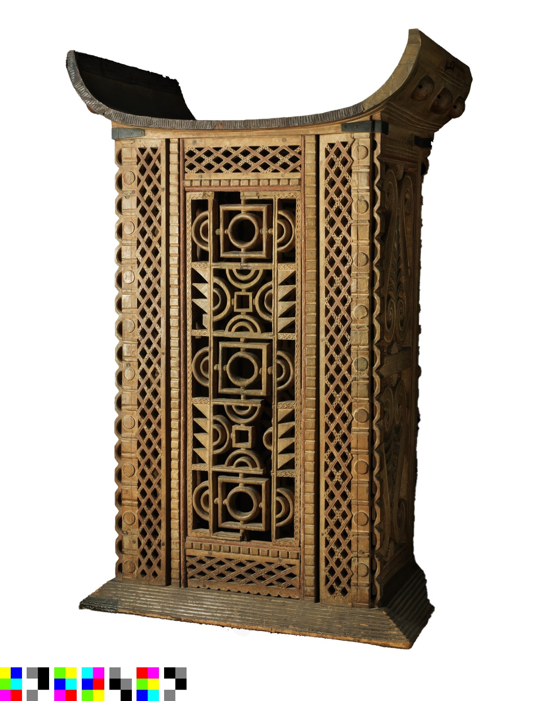
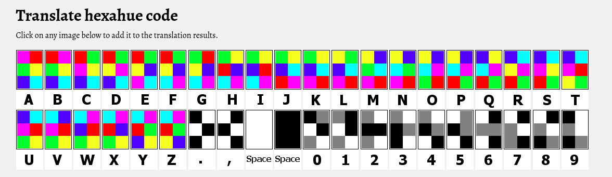

# Énoncé

Énoncé

**Pts: 50**

[FR]
Le roi Ghezo a remis ce fichier à ses intendants lors de la cérémonie d'Ato en hommage aux ancêtres royaux. Qu'y a-t-il à l'intérieur ?

[EN]
King Ghezo handed over this file to his stewards during the Ato ceremony in honor of the royal ancestors. What does it contain?

FLAG : CTF_[A-Za-z0-9]

Author: charliepy

File: [Ghezo.png](challenge_file/ghezo.png)

# Solution

Solution

Ghezo
Pour ce challenge, nous allons commencer par télécharger le fichier du challenge. En premier temps nous allons commencer par faire un (file nom_du_fichier) sur le fichier.

 

Nous remarquons que notre fichier est un netpbm image. Et comme n'importe quelle personne non informer, nous  irons chercher ce que c'est qu'un fichier netpbm et comment l'ouvrir ... 

 

Et voilà ; après avoir fouillé un tout petit peu, nous savons que l'extension de notre fichier est un .ppm et non un .png
Nous allons donc changer l’extension.

 Maintenant que nous avons notre fichier .ppm nous avons l'obligation de lire son contenu et de trouver le message caché a l’intérieur ; mais comment ?

 

Dans les écrits  de cet article, nous pouvons lire en bas (découvrez comment ouvrir un fichier .PBM ou convertir un fichier .PBM).
Ce bout de texte nous a permis de découvrir qu'il ya la possibilité de convertir les fichiers .pbm en d'autre fichiers images et voilà, nous tomber sur un script de convertion sur

 . 

En exécutant ce script nous obtenons ceci. 

 Déjà partir de cette image, nous remarquons qu'il y a quelque chose de nouveau par rapport a l'image de départ
avec Google Lens, quand nous analysons le jeu de couleur en bas de l’image, nous tombons sur plusieurs plateforme nous parlant de " Hexahue Alphabet «. 

 

En essayant de faire les correspondances, nous avons obtenons :   M1KW4B0
et conformément a la syntaxe du flag `CTF_[A-Za-z0-9]` , nous avons pu valider avec la syntaxe CTF_M1KW4B0

