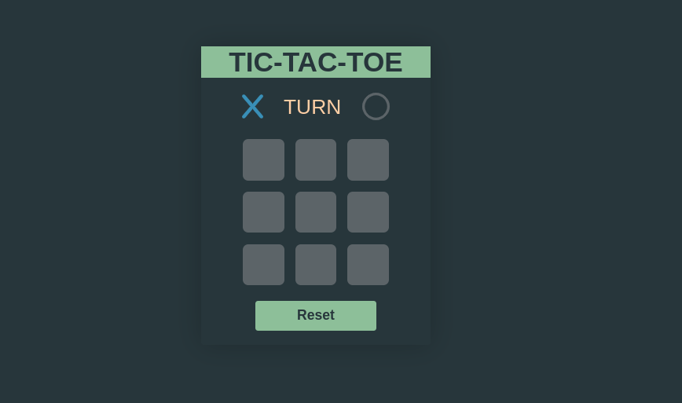
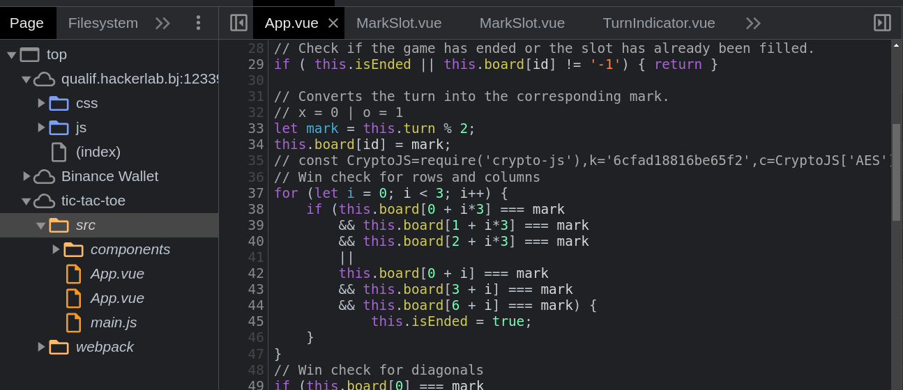

# Énoncé

Énoncé

**Pts: 80**

[FR]
Tu dois faire déjouer l'adversaire à temps. Au risque que la bombe n'explose, TIC TAC TOE !!!

[EN]
You have to defeat your opponent in time. At the risk of the bomb exploding, TIC TAC TOE !!!

Author: charliepy

link: [chal_web](http://qualif.hackerlab.bj:12339/)

# Solution 

Solution

La page web du challenge présentait le jeu _Tic Tac Toe_, la première intention c'était de jouer le jeu peut-etre avec un bot et le gagner un certain nombre de fois pour avoir le **FLAG**. Mais, lorsque vous jouez, vous constaterez que vous etes la seule à placer les deux pions. Mais quel game ??? Ce n'était donc pas gagner, l'objectif du jeu. Juste pour nous retarder.

Inpecter la page et sous l'onglet `source` de votre navigateur _Chrome_ vous dans le fichier `tic-tac-toe/src/app.vue` se cachait la mine d'or à la ligne 35 :

    // const CryptoJS=require('crypto-js'),k='6cfad18816be65f2',c=CryptoJS['AES']['encrypt'](message,k)['toString']();  
    output="U2FsdGVkX1/sPQHn8qbrD9LyPIipROeMnqke4B+JJEq8sVgV0zeA+ab2oHP92avnl2vzHVBs0/0NeOLbGmoj9g=="

Il s'agit d'un chiffrement **AES**

Avec la plateforme de déchiffrement [Jsons](https://www.jsons.cn/) on peut decoder le message avec la clé `k=6cfad18816be65f2`

`Output: FQCZ05pWF6h1UZO0Z52741215=54675= `

Ce n'est pas évident de reconnaitre directement ce chiffrement mais avec l'option _Magic_ de [cyberchef](https://gchq.github.io/), on a sû que c'était du xor avec clé 5. Mais le méssage n'était pas au complet avec cet outil.

Direction [dcode.fr](https://www.dcode.fr/chiffre-xor) et bruteforcer le message chiffré:

**FLAG:** _CTF_50uRC3m4P_J5_072147408013208_

