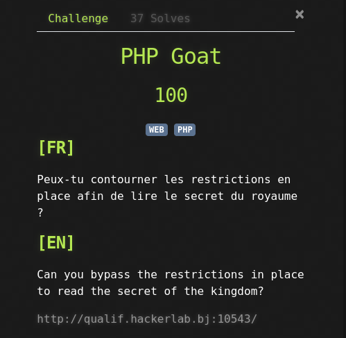
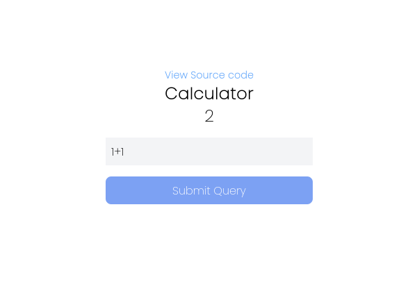
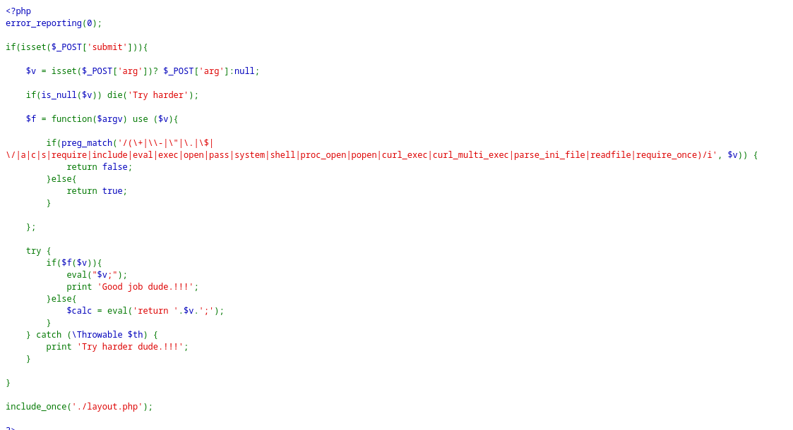
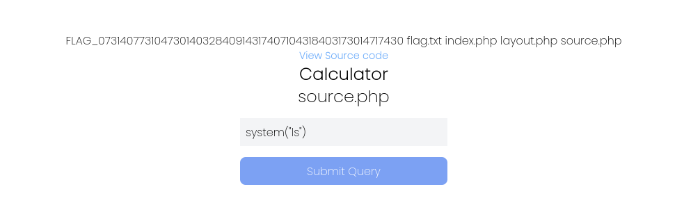
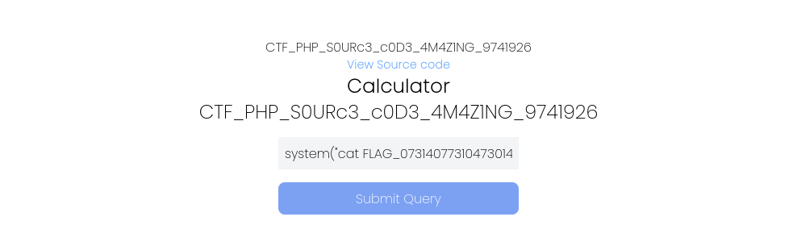

Voici le contexte

Une fois sur liste, nous avons cette calculatrice qui nous permet de faire des calculs basics

Essayons de voir le code source

On remarque la fonction **eval()**. Après quelques recherches, on découvre que cette dernière permet d'exécuter du code php comme s'il s'agissait d'une partie du programme. Du coup lorsqu'on essait **system("ls")** on obtient le résultat suivant

Super !!! On arrive à lister les fichiers du répertoire courant. Maintenant il nous suffit de faire **system("cat FLAG_07314077310473014032840914317407104318403173014717430")** Et on obtient le flag

FLAG: **CTF_PHP_S0URc3_c0D3_4M4Z1NG_9741926**
